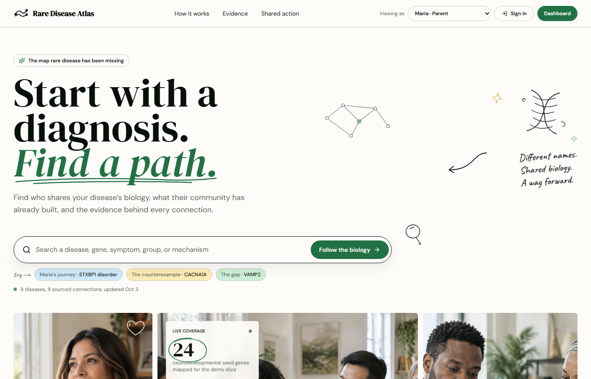
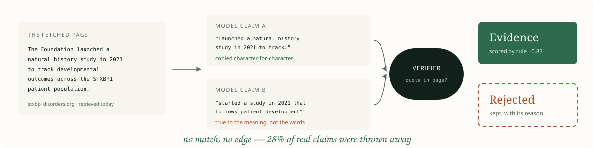
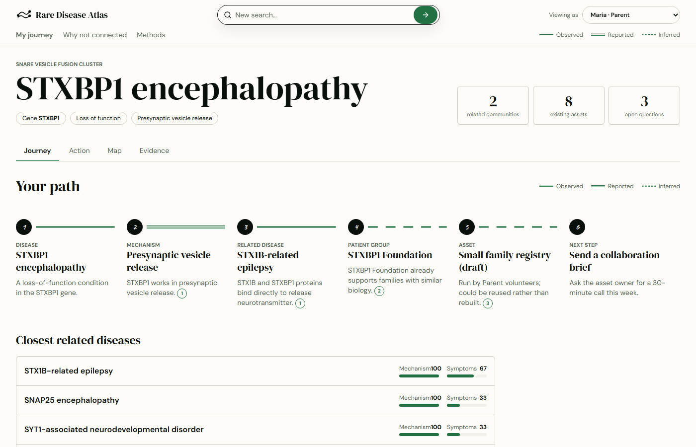
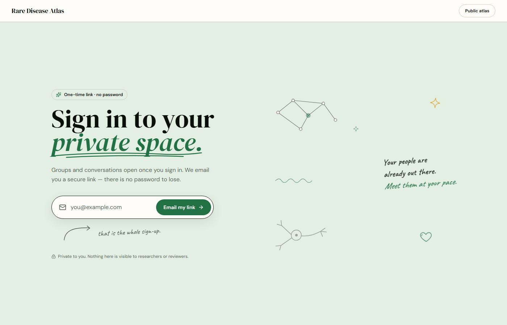
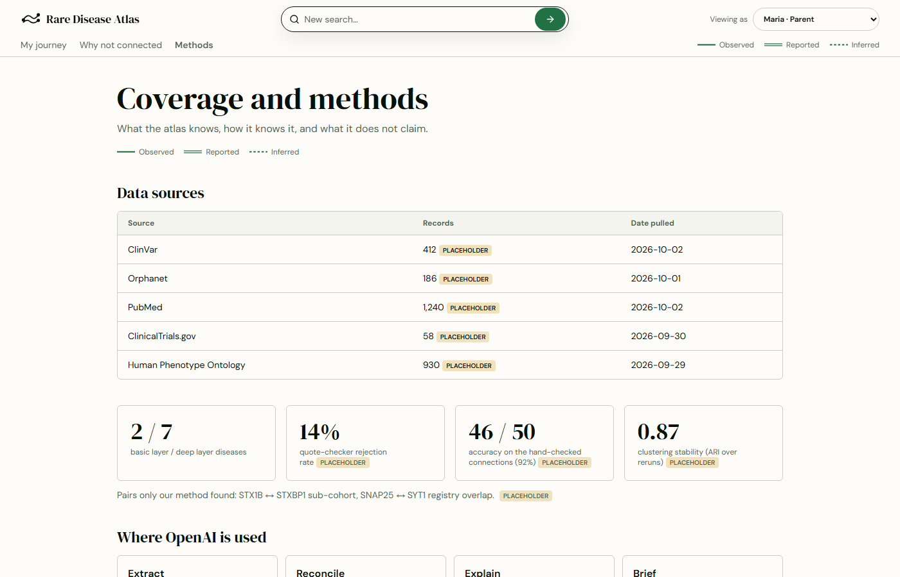

<div align="center">



<a href="https://github.com/Rohit-ATS/Buffalo-Track">
  
</a>

<br>


<br>


</div>


<div align="center">



<sub><i>The real app. Search a gene, follow the biology, inspect every receipt.</i></sub>

</div>


##  One search, one continuous path



> The node we cluster on is a **mechanism unit** — `gene × effect class`.
> `CACNA1A` loss-of-function and gain-of-function are two different things, never merged.
> That is the difference between a useful map and a persuasive one.


##  Every edge declares how it is known


<div align="center"><sub>Nothing scraped from the open web is ever <code>observed</code>.</sub></div>


##  The verifier is the whole point



```text
normalise whitespace + case, strip inline markdown
is the quote a substring of the page we actually fetched?
    yes → evidence, scored by rule
    no  → rejected, reason kept
```

| | |
|---|---|
| A paraphrase | ✗ rejected |
| An invention | ✗ rejected |
| A quote under 40 chars | ✗ rejected — *"registry"* is on every page |
| Copied character-for-character | ✓ **evidence** |

<details>
<summary><b>Why confidence is never asked of the model</b></summary>

<br>

A model's self-reported certainty is not evidence. A verified claim starts at `0.50` and moves
on observable facts — first-party publisher, concretely named asset, stated participant count,
named investigator — capped at `0.95`, because reported evidence never reaches certainty.

**Every score carries the sentence that produced it**, so *"why 0.83?"* has a real answer.

</details>


##  Watch a claim earn its place



The two **free** stages sit either side of the expensive ones. The classifier decides what is
worth fetching; the verifier decides what was worth extracting.

<div align="center">

**Deliberately not scraped** — they have real APIs, so scraping them is money burned

`ClinicalTrials.gov` · `PubMed` · `Europe PMC` · `NIH RePORTER` · `HPO` · `Monarch` · `Orphanet`

</div>


##  Measured, not estimated



<details>
<summary><b>What those 37 assets actually are</b></summary>

<br>

| Kind | Found | | Kind | Found |
|---|---:|---|---|---:|
| Natural history study | **16** | | Animal / cell model | 2 |
| Patient registry | **7** | | Biobank | 1 |
| Dataset | 5 | | Protocol | 1 |
| Outcome measure | 5 | | | |

Real records from real foundation pages — **STARR Natural History Study** (CHOP), the
**STXBP1 disorders registry**, **Simons Searchlight**'s VAMP2 cohort, the **KCNQ2 Cure
Alliance** programme.

</details>


##  Everything is live

<table>
<tr>
<td width="55%">

Discovery runs **offline**. A browser never calls Bright Data and never fetches a page — it
reads what a run already stored.

Twenty people searching the same gene costs **nothing** and answers in milliseconds.

What *is* live is Postgres replication. Realtime honours RLS, so a subscriber receives a row
only if their own policy would return it.

</td>
<td width="45%">

| Stream | Appears as |
|---|---|
| `atlas_discovered_assets` | assets landing mid-run |
| `atlas_discovery_runs` | a "running" badge |
| `circle_messages` | group chat |
| `private_messages` | 1:1 threads |
| `circle_members` | a join approved |
| `nodes` / `edges` | the public graph |

</td>
</tr>
</table>


##  Who sees what

<div align="center">

| Role | Family space | Groups | Messages | Moderation | Evidence | Research | Ops |
|---|:-:|:-:|:-:|:-:|:-:|:-:|:-:|
| **Family member** | ✅ | ✅ | ✅ | · | · | · | · |
| **Circle steward** | ✅ | ✅ | ✅ | ✅ | · | · | · |
| **Evidence reviewer** | · | · | · | · | ✅ | ✅ | · |
| **Administrator** | ✅ | ✅ | ✅ | ✅ | ✅ | ✅ | ✅ |

</div>

> A researcher does **not** get into families' private space. The RLS refuses it and the nav
> does not pretend otherwise. Roles cannot be self-escalated — the update policy pins
> `role = current_profile_role()`.


##  The app

<table>
<tr>
<td width="50%"><br><sub><b>Disease page</b> — connections, receipts, and assets discovered on the web</sub></td>
<td width="50%"><br><sub><b>Dashboard</b> — one entry point; the role decides the nav</sub></td>
</tr>
<tr>
<td width="50%"><br><sub><b>Methods</b> — sources, pull dates, and what each number means</sub></td>
<td width="50%"><br><sub><b>Every colour here is the app's own</b> — straight from <code>styles.css</code></sub></td>
</tr>
</table>


##  Run it

```bash
supabase db push                                   # every migration
psql "$DATABASE_URL" -f supabase/seed.sql -f supabase/seed_atlas.sql

cd frontend && bun install && cp .env.example .env
bun run dev                                        # localhost:8080
```

<details>
<summary><b>🛰️ Running the discovery pipeline</b></summary>

<br>

```bash
cd backend && pip install -r requirements.txt && cp .env.example .env

python -m app.discovery.cli doctor            # verify creds + zones (2 requests)
python -m app.discovery.cli plan STXBP1       # what will this cost? spends nothing
python -m app.discovery.cli run STXBP1 --disease-id stxbp1 --max-pages 6
```

`doctor` checks each Bright Data **zone by name** — a valid token says nothing about whether a
zone called `serp_api1` exists, and a mismatch fails per request, not at auth.

~**18 billable requests per gene**. `BRIGHT_DATA_MAX_REQUESTS` is a hard stop, and a run that
hits it records where it stopped rather than losing the work. → [backend/DISCOVERY.md](backend/DISCOVERY.md)

</details>

<details>
<summary><b>🚢 Backend API, Render and GitHub Pages</b></summary>

<br>

[`backend/`](backend/README.md) exposes `POST /api/v1/search`, `/healthz`, `/readyz`;
`render.yaml` deploys it to Render. The Pages workflow sets the public
`VITE_BACKEND_URL` to the Render API; set the exact Pages origin in Render's
`CORS_ORIGINS`. Add the Supabase anon key as the repository Actions secret `VITE_SUPABASE_ANON_KEY` before the Pages workflow runs. Checklist:
[backend/RENDER_DEPLOY.md](backend/RENDER_DEPLOY.md).

[`deploy-pages.yml`](.github/workflows/deploy-pages.yml) prerenders the public routes to GitHub
Pages on every push to `main`. Pages cannot run server functions, so graph-backed search stays
on Render. The artifact contains no credentials.

</details>

<details>
<summary><b>🧰 Commands &amp; layout</b></summary>

<br>

| Command | Does |
|---|---|
| `bun run dev` / `build` / `test` | dev server · production build · Vitest |
| `bun run lint` / `format` | ESLint · Prettier |
| `bunx tsc --noEmit` | typecheck |
| `bun run seed:generate` | regenerate `seed_atlas.sql` from the curated dataset |

```
frontend/   TanStack Start app, role-gated dashboard, realtime hooks
backend/    FastAPI service + discovery pipeline
supabase/   migrations and seeds — the schema is the contract
docs/       assets and data provenance
```

</details>


##  Honest gaps

A project about traceable evidence has to be traceable about itself.

| Gap | Why it is still open |
|---|---|
| A **9-unit slice**, not every monogenic disease | the curated backbone is a snapshot; discovery is live on top |
| `atlas_publications` / `atlas_grants` are **empty** | seeding either would mean inventing a paper record |
| `hgnc_id`, `reactome_id`, `go_id`, `hpo_id` are **null** | needs a registry lookup this snapshot never did |
| Cluster stability & audit precision **unmeasured** | the rejection rate is real because that pipeline exists; these aren't, and an unmeasured number is not a perfect one |
| Assets inherit their run's `disease_id` | entity reconciliation is not built yet |


<div align="center">

### Research navigation, not medical advice.

<sub>Connections and actions should be reviewed by qualified experts.</sub>

<br><br>


<br>

<sub>

[Contributing](CONTRIBUTING.md) · [Data provenance](docs/DATA_PROVENANCE.md) · [Discovery pipeline](backend/DISCOVERY.md) · [Database](supabase/README.md)

</sub>

</div>
