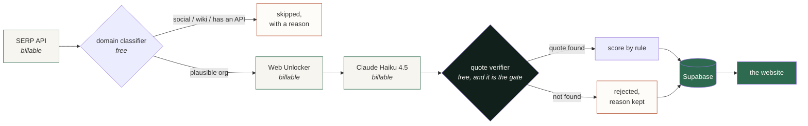

<div align="center">


**Different names. Shared biology. A way forward.**

A graph of rare diseases connected by *mechanism* rather than by name — where every
edge shows its source, its quote, and the date it was read.

[](#every-edge-declares-how-it-is-known)
[](#the-verifier-is-the-whole-point)
[](#everything-is-live)
[](#how-it-is-built)

</div>

---

## The problem, in one sentence

About **10,000** rare diseases exist and fewer than **5%** have an approved treatment, so when
a family gets one of those diagnoses they often end up running the research effort themselves
— from zero, without knowing that another community three genes away already built the
registry they need.

> *A diagnosis should not come with a research job description.*

---

## One search, one continuous path


The atlas follows **mechanism, not names**. The node it clusters on is a *mechanism unit* —
`gene × effect class` — so `CACNA1A` loss-of-function and `CACNA1A` gain-of-function are two
different things that are never merged. That distinction is the difference between a useful
map and a merely persuasive one.

---

## Every edge declares how it is known


Nothing scraped from the open web is ever `observed`. A page saying something is `reported`
evidence **at best**, and only once its quote verifies.

---

## The verifier is the whole point


A model reads one page and copies the sentence supporting each claim. Then the claim has to
survive this:

```text
normalise whitespace + case, strip inline markdown
is the quote a substring of the page we actually fetched?
    yes -> store as evidence, score it by rule
    no  -> store as rejected, with the reason
```

A paraphrase fails. An invention fails. A quote under 40 characters fails even when it does
appear, because the word *"registry"* is on every foundation page and identifies nothing.

**Rejected claims are kept**, with their reason. The rejection rate is a headline number and
cannot be computed from rows that were thrown away.

> Confidence is never asked of the model — a model's self-reported certainty is not evidence.
> A verified claim starts at `0.50` and moves on observable facts: first-party publisher,
> concretely named asset, stated participant count, named investigator. Capped at `0.95`,
> because reported evidence never reaches certainty. **Every score carries the sentence that
> produced it**, so "why 0.83?" has a real answer.

---

## Measured, not estimated

Counted from the database after eight live discovery runs. None of these is a placeholder.

| | |
|---|---:|
| Candidate URLs discovered | **709** |
| Pages fetched and stored | **30** |
| Claims extracted | **81** |
| Claims whose quote verified | **58** |
| **Claims rejected by the verifier** | **23 · 28.4%** |
| Reusable research assets found | **37** |

<details>
<summary><b>What those 37 assets actually are</b></summary>

<br>

| Asset kind | Found |
|---|---:|
| Natural history study | 16 |
| Patient registry | 7 |
| Dataset | 5 |
| Outcome measure | 5 |
| Animal / cell model | 2 |
| Biobank | 1 |
| Protocol | 1 |

Real records pulled from real foundation pages: the **STARR Natural History Study** (CHOP),
the **STXBP1 disorders registry** (STXBP1 Foundation), **Simons Searchlight**'s VAMP2 cohort,
and the **KCNQ2 Cure Alliance** programme.

</details>

---

## Where the data comes from

Official biomedical sources have APIs and bulk files — use them. This project adds the layer
they miss: **patient organizations and the research infrastructure they own**, which lives on
foundation websites, not in a database with an endpoint.



The two free stages sit either side of the expensive ones on purpose: the classifier decides
what is worth fetching, and the verifier decides what was worth extracting.

**Deliberately not scraped**, because scraping data that has a real API is money burned:
`ClinicalTrials.gov`, `PubMed / Europe PMC`, `NIH RePORTER`, `HPO`, `Monarch`, `Orphanet`.

---

## Everything is live

Discovery runs **offline**, from the pipeline. A visitor's browser never calls Bright Data and
never fetches a page — it reads what a run already stored. Twenty people searching the same
gene costs nothing and answers in milliseconds.

What *is* live is Postgres replication. These stream over Supabase Realtime, and because
Realtime honours RLS, a subscriber receives a row only if their own policy would return it:

| Stream | Shows up as |
|---|---|
| `atlas_discovered_assets` | assets appearing on a disease page mid-run |
| `atlas_discovery_runs` | a "discovery running" badge |
| `circle_messages` | group chat, no refresh |
| `private_messages` | one-to-one threads |
| `circle_members` | a join request being approved |
| `nodes` / `edges` | the public graph view |

<details>
<summary><b>Subscribing from your own client</b></summary>

<br>

```js
import { createClient } from '@supabase/supabase-js'

const supabase = createClient(
  import.meta.env.VITE_SUPABASE_URL,
  import.meta.env.VITE_SUPABASE_ANON_KEY
)

const { data: nodes } = await supabase.from('nodes').select('*')
const { data: edges } = await supabase.from('edges').select('*')

supabase
  .channel('graph')
  .on('postgres_changes', { event: '*', schema: 'public', table: 'nodes' }, applyNodeChange)
  .on('postgres_changes', { event: '*', schema: 'public', table: 'edges' }, applyEdgeChange)
  .subscribe()
```

</details>

---

## Who sees what

One dashboard; the role decides the nav. Defined in a single table
([`access.ts`](frontend/src/lib/access.ts)) that mirrors the row-level security, so the
interface never offers a section whose queries would come back empty.

| Role | Family space | Groups | Messages | Moderation | Evidence | Research | Ops |
|---|:-:|:-:|:-:|:-:|:-:|:-:|:-:|
| **Family member** | yes | yes | yes | — | — | — | — |
| **Circle steward** | yes | yes | yes | yes | — | — | — |
| **Evidence reviewer** | — | — | — | — | yes | yes | — |
| **Administrator** | yes | yes | yes | yes | yes | yes | yes |

A researcher does **not** get into families' private space. The RLS refuses it, and the nav
does not pretend otherwise. Roles cannot be self-escalated: the update policy pins
`role = current_profile_role()`. Generic evidence stays reviewer-only, and the public FastAPI
search returns nodes and edges without evidence content. The service-role key bypasses RLS,
stays server-side, and must never carry a `VITE_` prefix. See
[docs/DATA_PROVENANCE.md](docs/DATA_PROVENANCE.md) for the current model.

---

## Quick start

```bash
# 1 - database
supabase db push                       # applies every migration
psql "$DATABASE_URL" -f supabase/seed.sql -f supabase/seed_atlas.sql

# 2 - frontend
cd frontend && bun install
cp .env.example .env                   # SUPABASE_URL + keys
bun run dev                            # http://localhost:8080
```

Without `.env` the app still runs: search reports that the live atlas is not connected and the
curated sample path carries the demo.

<details>
<summary><b>Running the discovery pipeline</b></summary>

<br>

```bash
cd backend && pip install -r requirements.txt
cp .env.example .env                   # Bright Data + Anthropic + Supabase

python -m app.discovery.cli doctor              # verify creds and zones (2 requests)
python -m app.discovery.cli plan STXBP1         # what would this cost? spends nothing
python -m app.discovery.cli run STXBP1 --disease-id stxbp1 --max-pages 6
```

`doctor` checks each Bright Data **zone by name**, because a valid API token says nothing
about whether a zone called `serp_api1` exists in that account — and a mismatch fails per
request, not at auth.

A run is roughly **18 billable requests per gene**. `BRIGHT_DATA_MAX_REQUESTS` is a hard stop,
and a run that hits it records where it stopped rather than losing the work already done.
Full detail in [backend/DISCOVERY.md](backend/DISCOVERY.md).

</details>

<details>
<summary><b>Backend API, Render and GitHub Pages</b></summary>

<br>

The search API lives in [`backend/`](backend/README.md) and exposes `POST /api/v1/search`,
`/healthz` and `/readyz`; `render.yaml` deploys it as a Render web service. Copy
`backend/.env.example` to `backend/.env`, then set `BACKEND_URL` in `frontend/.env`. Before
production, follow the [Render checklist](backend/RENDER_DEPLOY.md).

[`.github/workflows/deploy-pages.yml`](.github/workflows/deploy-pages.yml) prerenders the
public routes to GitHub Pages on every push to `main`, using the same components and styles as
the deployed app. Pages cannot run server functions, so the graph-backed search stays on the
Render deployment; the sample-data research views work in the static preview. The Pages
artifact contains no credentials. Enable it under **Settings → Pages → Source → GitHub
Actions**.

</details>

<details>
<summary><b>Frontend commands</b></summary>

<br>

| Command | What it does |
|---|---|
| `bun run dev` | dev server on port 8080 |
| `bun run build` | production build into `.output/` |
| `bun run test` | Vitest suite |
| `bun run lint` | ESLint |
| `bun run format` | Prettier write |
| `bunx tsc --noEmit` | typecheck |
| `bun run seed:generate` | regenerate `supabase/seed_atlas.sql` from the curated dataset |

</details>

---

## How it is built

| Layer | Choice | Why |
|---|---|---|
| Frontend | TanStack Start, React 19, Tailwind 4 | SSR with typed file routes |
| Database | Supabase Postgres, RLS, Realtime | the policies *are* the access model |
| Pipeline | Python, httpx, Bright Data | runs offline, writes to Postgres |
| Extraction | **Claude Haiku 4.5** | the model only reads and copies, and anything it invents is discarded — so the cheapest tier is the right one |
| API | FastAPI on Render | |

```
frontend/   TanStack Start app, role-gated dashboard, realtime hooks
backend/    FastAPI service + the discovery pipeline (DISCOVERY.md)
supabase/   migrations and seeds - the schema is the contract
docs/       assets and data provenance
```

### Schema notes

- `evidence.embedding` is `vector(1536)`, matching OpenAI `text-embedding-3-small`. Change it
  in the migration *before* first run if your model differs.
- Each `evidence` row attaches to a node or an edge; at least one is required.
- A reported edge must carry a quote — a check constraint rejects one without.
- Confidence and the rule that set it are both `not null`. A number with no reason is not a
  measurement.

---

## Contributing

Bug reports and feature requests use the repository's issue forms. Read
[CONTRIBUTING.md](CONTRIBUTING.md) for local setup, required checks, migration guidance, and
the rules for handling secrets and private data. Research data, seed sources, reproduction
steps and known limitations are in [docs/DATA_PROVENANCE.md](docs/DATA_PROVENANCE.md).

---

## Honest gaps

A project about traceable evidence has to be honest about its own.

- **This is a 9-unit slice**, not every monogenic disease. The curated backbone is a snapshot;
  the discovery layer is real and live on top of it.
- **`atlas_publications` and `atlas_grants` are empty tables.** The snapshot has
  database-level sources, never an individual paper record — seeding either would mean
  inventing one.
- **`hgnc_id`, `reactome_id`, `go_id`, `hpo_id` are null** on every seeded row. They need a
  registry lookup this snapshot never did.
- **Cluster stability and manual audit precision are not measured.** The extraction rejection
  rate is, because that pipeline exists. The other two need work that has not been done, and
  an unmeasured number is not a perfect one.
- **Discovered assets inherit their run's disease id**, so a page found under a `KCNQ2` query
  that happens to sit on another foundation's domain is tagged `KCNQ2`. Entity reconciliation
  is not built yet.

---

<div align="center">

### Research navigation, not medical advice.

<sub>Connections and actions should be reviewed by qualified experts.</sub>

<br>

*The rarest thing in rare disease is a map.*

</div>
